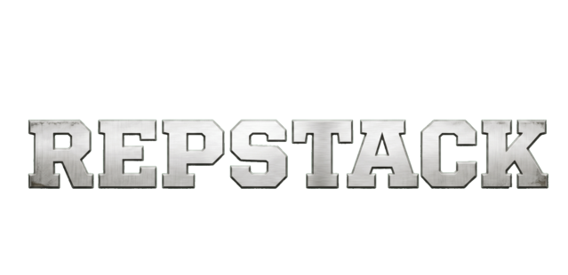
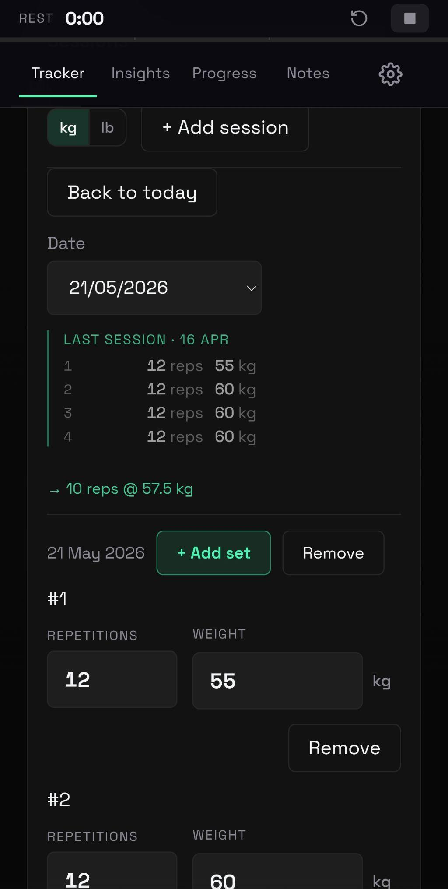
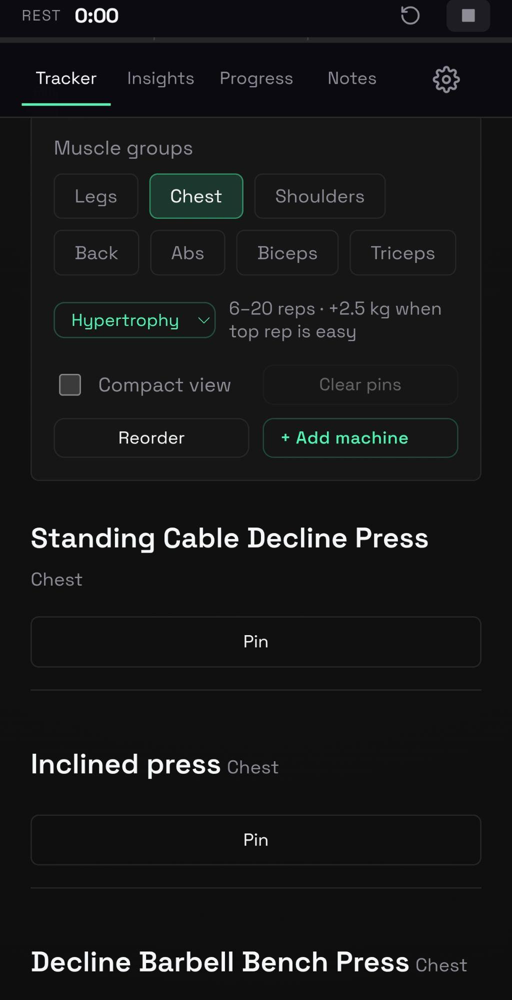
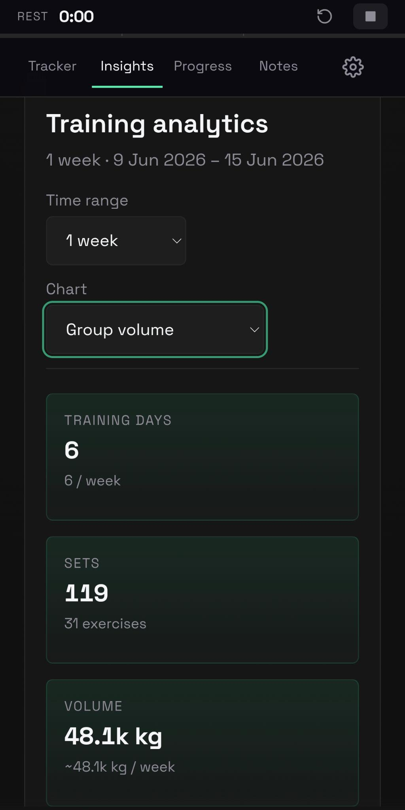
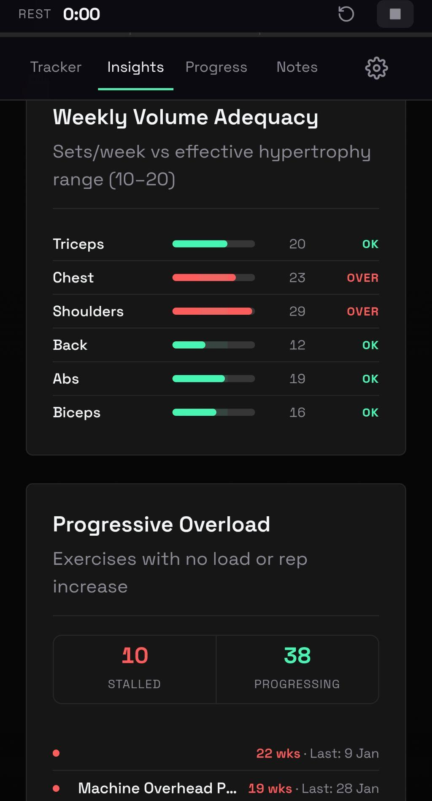
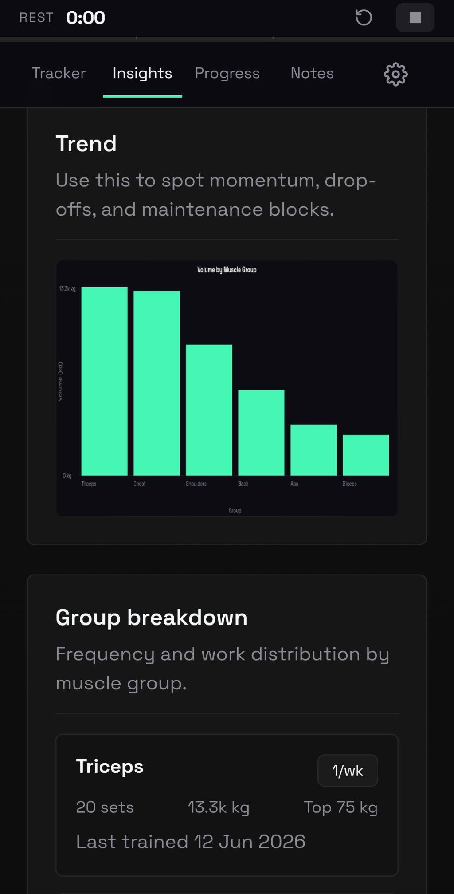
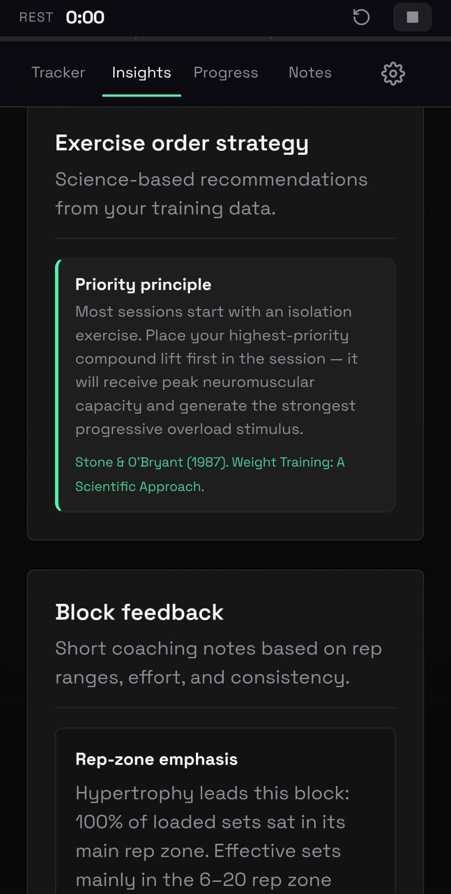
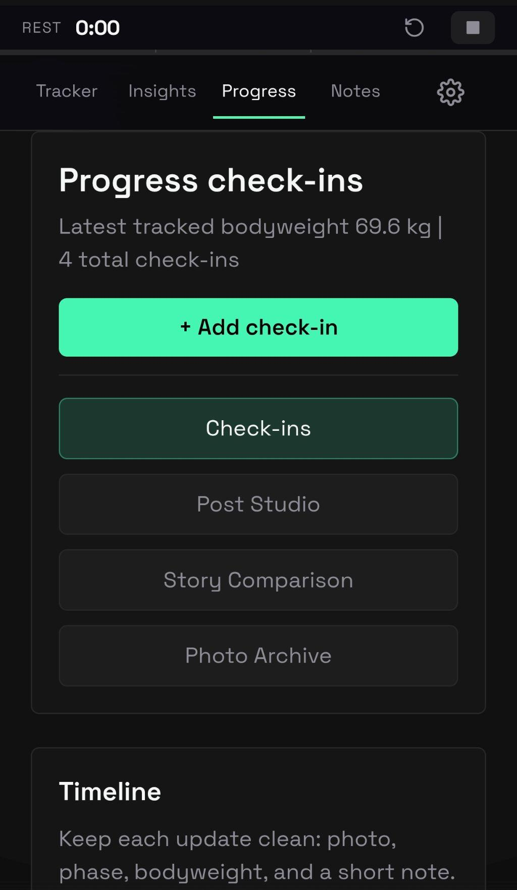

<p align="center">
  
</p>

# RepStack — Engineering Case Study

**Live product**: https://rep-stack.pages.dev/

## What this is

RepStack is a strength-training tracking application I designed and built from scratch, and now run as a commercial product. I use it myself to coach paying clients: they log every set they train, record physique check-ins with photos, and receive evidence-based feedback on their training (volume adequacy, strength trends, recovery conflicts) without needing a coach to manually review their numbers.

This repository is **not the product's source code**. It is a written case study of how the system is designed, what data model it runs on, and why I made the engineering decisions I did, together with one standalone code sample so a reader can see how I actually write code, not just read a description of it.

## Why the full source is not here

RepStack is a live commercial product with paying users, and the codebase is the product. Publishing it in full would let anyone clone the app outright. I am sharing this repository for the purposes of a job application, so that prospective employers can assess my engineering ability and judgement without me giving away something I sell. Everything described below is accurate to the real, deployed application; nothing is invented or simplified for the write-up.

## How it was built

RepStack started as a tool for my own coaching practice — I wanted something faster than a spreadsheet for logging sets on a gym floor, and one that could surface the kind of feedback a coach gives (is this person training enough volume, are they actually getting stronger, are they overtraining a muscle group) automatically. I built and have maintained it solo, end to end: product decisions, UI, data model, sync logic, hosting, and the payment integration for a paid tier.

It is a **local-first, serverless** web application — there is no traditional backend database. Each user's training history is stored as a single structured JSON document plus a folder of photos, sitting in their own Google Drive:

```
Browser (IndexedDB)  <-- sync -->  Google Drive (JSON state file + photos)
        ^                                  ^
        |                                  |
   instant reads/writes            durable, user-owned storage
   works offline                   survives device loss, multi-device access
```

This was a deliberate architectural choice rather than a shortcut. It removes the need to run and pay for a database, makes data ownership and privacy straightforward (the user's data lives in storage they already control), and means the app works offline by default. The trade-off is that the local-versus-remote sync logic has to be handled carefully — merging state on login, avoiding duplicate file uploads, and never letting a stale local copy silently overwrite a user's remote history.

### Data model

The state document is built around a small number of core collections:

- **`machines[]`** — the user's exercise catalogue (name, primary and secondary muscle group, equipment type). Supports matching exercise names in both English and Spanish, with an alias table so informal gym terminology ("Smith Press", "Scott Curl") resolves to a canonical entry.
- **`workoutLogs[]`** — one entry per training session, each containing **`sets[]`** (reps, weight, RPE, and timestamps). This is the source fact table that every other metric is derived from.
- **`checkIns[]`** — bodyweight, estimated body fat, training phase, and photo references, timestamped to build a progress timeline.
- Everything else — weekly volume, effective volume per muscle group, estimated one-rep-max trends, responder classification, recovery-conflict flags — is computed on read from the raw logs above. None of it is stored as a separate aggregate, so there is nothing to keep in sync or invalidate.

### Stack

| Layer | Choice | Reasoning |
|---|---|---|
| Frontend | Vanilla JavaScript, HTML5, CSS3 | No framework overhead for a UI that has to feel instant — logging a set mid-workout cannot wait on a render cycle |
| Local storage | IndexedDB | Offline-first; gym wifi is unreliable, and the app should never block on a network call to log a set |
| Remote storage | Google Drive API v3 (OAuth 2.0) | User-owned data, no storage infrastructure to run or pay for |
| Hosting | Cloudflare Pages and Pages Functions | Static frontend plus small serverless functions for authentication gating and payment webhook handling |
| Internationalisation | Custom key-based translation system | Full English/Spanish coverage across roughly 170 exercise names and all interface text |

## How the data pipeline works

The input a user provides is deliberately minimal: reps, weight, and perceived effort (RPE) per set. Everything a coach would normally calculate by hand is derived from that:

1. **Effective volume** — each set is attributed to primary and secondary muscle groups, validated against an EMG-based muscle map, with secondary-muscle contribution split proportionally so volume is not double-counted across a compound lift that works several muscles at once.
2. **Strength trend (estimated one-rep max)** — every set is converted to an estimated 1RM using the Epley formula, then tracked over time per exercise.
3. **Responder classification** — month-over-month growth in estimated 1RM is compared against thresholds drawn from the resistance-training literature to flag a high or low responder, with an expected-gain ceiling scaled by training age, so feedback does not promise a beginner's progress curve to someone three years into training.
4. **Recovery-conflict detection** — sessions are grouped by muscle group and flagged when the same group is trained twice within 48 hours without adequate separation in volume.
5. **Volume adequacy** — weekly volume per muscle group is checked against an evidence-based effective range and surfaced as a visual flag rather than a hard rule, since individual recovery capacity varies.

All of this runs client-side, on read, directly from the raw log. There is no separate analytics service and no stored aggregate that could drift out of sync with the underlying data.

## Code sample

[`showcase-code/responder-classification.js`](showcase-code/responder-classification.js) is a standalone, rewritten version of step 3 above. It has been deliberately rewritten to remove any coupling to the application's internal state shape, Drive sync code, or UI layer, so it can be read and run in isolation. It implements:

- `estimateE1rm(weightKg, reps)` — Epley-formula estimation of one-rep max
- `classifyResponderStatus(sets)` — month-over-month strength trend and high/low responder threshold
- `estimateExpectedGainCap(trainingAgeMonths)` — a realistic gain ceiling based on training age

It can be run directly with `node showcase-code/responder-classification.js`, which executes the worked example included at the bottom of the file.

**Scientific basis**: Grgic et al. (2017) and Schoenfeld (2010) on the volume dose-response relationship for hypertrophy and strength; Zourdos et al. (2016) on RPE-based autoregulation; and the well-documented individual variability in resistance-training response between high and low responders.

## Other parts of the product not detailed here

- Google OAuth login flow with token refresh and offline support
- Bidirectional Google Drive sync with conflict resolution between local and remote state
- Photo upload logic with file-ID caching to avoid creating duplicate files on repeated uploads
- A paid tier gated through a payment webhook (Buy Me a Coffee), tracked by expiry date
- A fully bilingual interface (around 170 exercises, English and Spanish) with alias resolution for informal gym terminology

## Screenshots

<p align="center">
  
  
  
</p>
<p align="center">
  
  
  
</p>
<p align="center">
  
</p>

These are screenshots of the live, deployed application — the dark theme, layout, and analytics shown are exactly what a user sees, not mock-ups.
